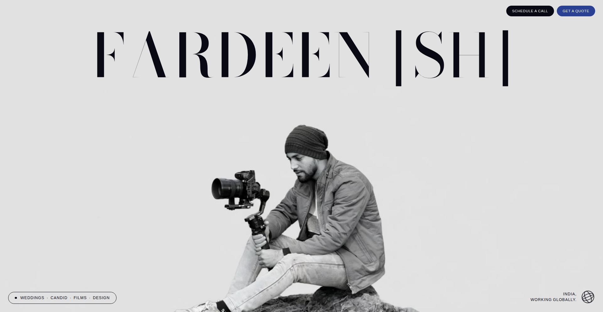
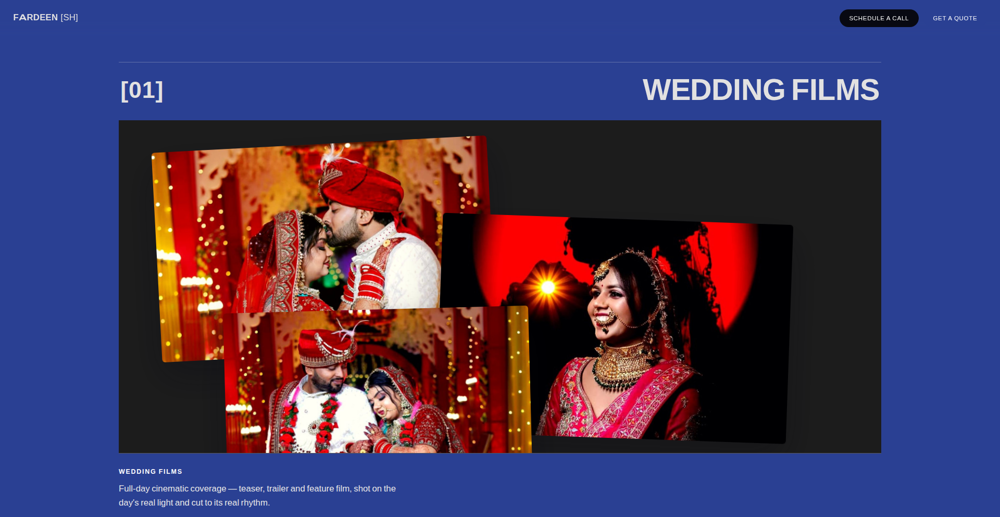
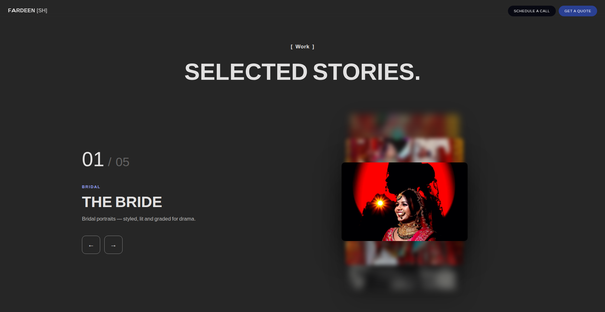
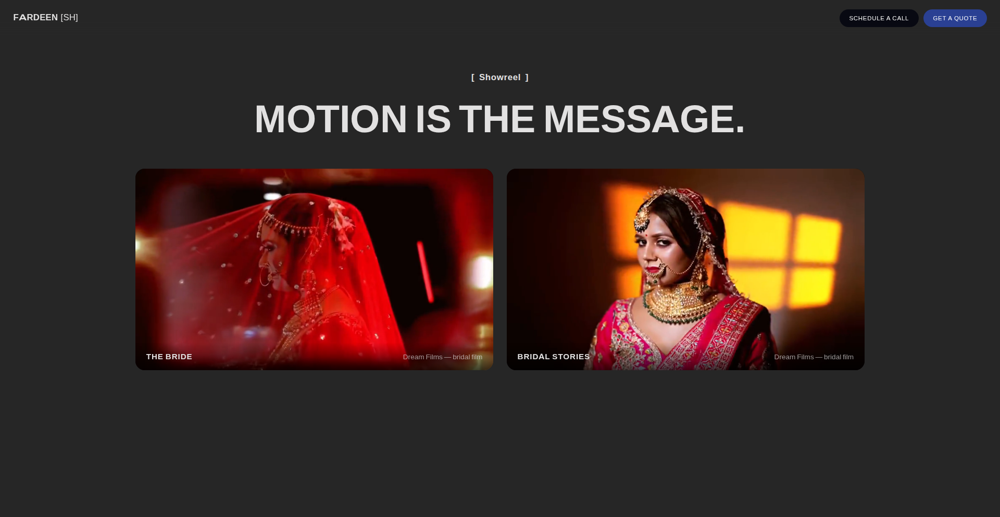
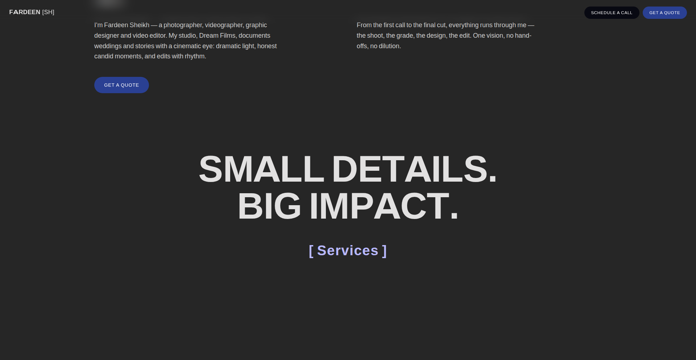
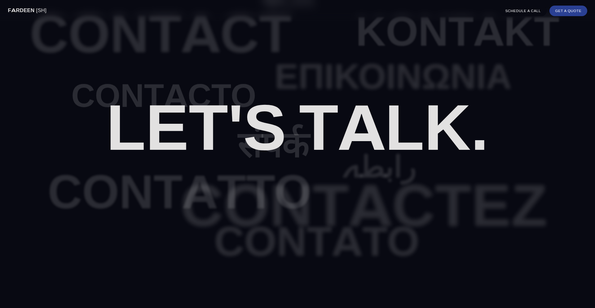
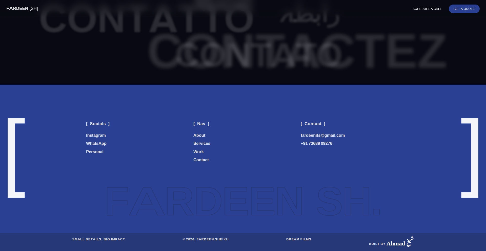

# Fardeen Sheikh — Portfolio Website

A cinematic single-page portfolio website for **Fardeen Sheikh**, freelance photographer, videographer, graphic designer and video editor (Dream Films).

🌐 **Live site:** https://fardeen-sheikh.netlify.app/

🎬 **Video walkthrough:** [walkthrough.mp4](./walkthrough.mp4) — a full tour of every section with the real code behind the effects (text overlays, no voiceover).

## Screenshots

| Hero | Services |
|---|---|
|  |  |

| Work | Showreel |
|---|---|
|  |  |

| About | Contact |
|---|---|
|  |  |

| Footer |
|---|
|  |

## What's inside

- **Cinematic hero** — giant editorial wordmark, real portrait, custom cursor ring
- **Sketch-sticker cursor trail** — moving the cursor leaves hand-drawn doodles (camera, lens aperture, heart, wedding ring) with pamidor-exact timing: 840ms life, max 4 on screen, desktop only
- **Services** — 4 crafts in dark charcoal panels, photography graded to one cinematic look (crushed blacks, golden-hour skin tones, crimson accent)
- **Work** — stacked project cards with blur-behind-active effect
- **Showreel** — scroll-triggered video autoplay (plays at ≥25% visibility, pauses offscreen)
- **Contact + footer** — socials, nav, contact details, and the builder's dual-script signature
- **Light-locked design** — looks identical in dark and light browser modes

## Run it

The whole site is one self-contained file — no build step, no dependencies:

```bash
# just open it
index.html
```

All images, videos and fonts are inlined; the only network calls are two Google Fonts (Caveat, Noto Nastaliq Urdu) for the footer signature.

## Built by

**Ahmad Sheikh** — [portfolio](https://sheikh-ahmad-am.github.io/portfolio/) · [GitHub](https://github.com/sheikh-ahmad-am)
